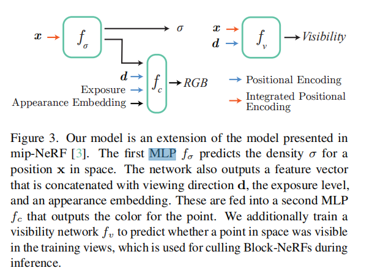

# 论文笔记

相关知识：

signed distance（1996） [ A volumetric method for building complex models from range images.](https://blog.csdn.net/qq_41318333/article/details/109780345)

## Instant Neural Graphics Primitives with a Multiresolution Hash Encoding

## Block-Nerf（2022.2）

关键词：large-scale environments

abstract：将场景划分成多个训练好的NeRF类型的block，这样加入新的场景的时候就不需要重新训练了。作者提供了多种architectural changes来使得满足需求。主要的修改点：加上了<mark>appearance embeddings</mark>，<mark>learned pose refinement</mark>和<mark>controllable exposure</mark>。并且introduce 了一个aligning appearance between adjacent NeRF的方法，这样就可以无缝连接了。作者的创新最大体现在San Francisco的街景展示上。

其实整体的网络架构都是基于mip-NeRF

4.1 block size和placement

怎么划分block？-》在交互点放置一个block-NeRF，然后这个block扩展直至占其他交互点的75%，这样的话每个block都会有50%的overlap（目的是更加方便地来converge）

4.2如何训练每个block-NeRF

参考NeRF-W使用 Generative Latent Optimization来优化appearance embedding vectors

这个appearance code使得模型可以表示不同的光照和天气。对这个appearance进行插值可以对场景的情况进行控制。

虽然我们假设提供了相机的姿态，但我们发现学习正则化的姿态偏移有利于进一步对齐。

在以前的基于NeRF的模型中已经探索了Pose refinement。这些offset包括平移和旋转分量

Exposure Input：提供相机exposure information可以更好地进行补偿

Transient Objects：如何处理一些行人或者移动的物体？（车之类）：使用一个语义分割的模型来对车进行mask，mask掉的位置不参与训练。

Visibility Prediction：由于不知道这个位置在给定的nerf中是否能够看见，我们又训练以恶搞新的模型来学习approximation of visibility。最终返回的是透明度这个参数（transmittance）

4.3如何merge

如何选择需要的nerfblock：在traget view中选择给定的半径以内的。然后计算associated visibility，根据visibility阈值再筛一遍。前面已经有visibility的网络了。

从选定的block nerf中我们得到了多张彩色图 using inverse distance weighting between the camera origin c and the centers xi of each Block-NeRF。也就是说彩色图的权重和相机到block的中心点有关，最终彩色图插值来实现。

appearance matching：由于appearance latent code是每个block独有的，所以需要进行匹配。实现方法：我们首先选择一个3d的匹配点matching location（要求这个点的visibility都是high的）确定后我们freeze掉block的权重来优化这个appearance code，训练这两个位置的L2 loss就可以了。

## UrBan NeRF

## Dense Depth Priors for Neural Radiance Fields from Sparse Input Views

abstract理解：想要表示一个房间就得需要上百张数据，这里使用了18张图片就可以表示出一个房间。teaser图上面做了实验，只有nerf的话表示有很多残影，如果加上sparse depth，那么就会好一点，最好的是加上dense depth priors的效果。

主要流程：根据多张图片进行稀疏重建，对于重建的稀疏结果进行深度补全的网络预测，结合这个补全好的深度网络进行nerf渲染，提出了关于深度的loss函数。最终可以输出稠密的深度图和RGB

## Neural Rays for Occlusion-aware Image-based Rendering（NeuRay）

[Github项目](https://github.com/liuyuan-pal/NeuRay)

## Acorn: Adaptive Coordinate Networks for Neural Scene Representation

相比较于传统的表示方法（mesh，点云， volume），隐式表示方法有潜力能表示出细节更好的效果，并且能够结合可微分的方法。但是现在在更高分辨率上的效果还不是很好，因此这篇论文提出了有一个混合implicit-explicit的网络结构和训练策略，能够动态地根据signal的复杂度来分配资源。是用了一个多尺度的block-cooridinate decomposition（有点像四叉树或者是八叉树）。整体架构其实还是encoder生成一个feature grid。然后一个轻量的decoder来解析出block里的东西。

implicit representation的方法优点： end-to-end differentiable, quickly optimizable, and scalable in learning-based pipelines.

Neural scene representations一个缺点是 inability to scale to complex scenes.  Coordinate networks 缺点是计算量大，效率低，比如必须计算完整个场景

这篇论文提出了一个block划分的 implicit–explicit coordinate network architecture for neural signal representations。我们的结构自动划分signal成多尺度的scale。输入是多尺度block的坐标，输出是不同坐标下block的结果的值。和前面工作不一样的一个点是不会将输入的xyz坐标map到输出，而是map到一个低分辨率的local features上面。这些features接着结合然后decode到block里面的数值。好处是：每个block只需要计算一次就能获得block对应的feature map，这样的话只需要querying里面的东西就可以加速。

还有一个创新点就是训练策略上面的创新。

**细节上**

如何划分？基于树的划分方法。比如我们可以将图像按照四叉树的方式进行划分。如果是三维空间的话，我们可以使用八叉树来进行划分。在图像的每个数值背后其实都是在不同scale的格子里面的，但是我们将每个值赋给特定的block（active block）

每个块内的块和输入域值通过一个全局块索引和一个连续的局部坐标来处理

## Mip-NeRF 360: Unbounded Anti-Aliased Neural Radiance Fields

处理大的unbounded场景，这篇工作是建立在mip-nerf上的。直接用会导致三个问题：

1. parameterization：unbounded 的场景下占据了一个比较大的欧式空间，正常的mip-nerf要求在一定的bounded domain

2. efficiency：细节需要更多的网络能力，每个ray都需要更多的querying。特别是nerf的查询原则是coarse-to-fine。因此我们训练两个网络，一个是proposal MLP一个是NeRF MLP。前者预测一个volumetric density 然后这个density可以用于后者的重采样中。需要注意的是，proposal MLP不是用输入图片来监督的，而是使用后者的histogram weights。这样我们通过多训练小的proposal网络，减少训练后者网络来达到降低训练成本的需求。（实现了用更多的网络参数，但是不至于大幅度增加训练时间）
   
   这样的策略有点像是onlilne distillation（蒸馏）

3. ambiguity：无界场景的内容可能只能被少量的光线观察到，这加剧了从二维图像中重建3D内容的固有模糊性。

解决parameterization：

## Neural 3D Scene Reconstruction with the Manhattan-world Assumption CVPR2022

## BNV-Fusion: Dense 3D Reconstruction using Bi-level Neural Volume Fusion CVPR2022

## Volume Rendering of Neural Implicit Surfaces NIPS2021

摘要：隐式表示提取的几何特征不太好，经常出现一些模糊的结果，我们将volume density换成一个几何的函数，以前都是用volume density来拟合几何。我们将体积密度函数定义为有符号距离函数(signed distance function SDF)表示的拉普拉斯累积分布函数(CDF)。三个优点：1. 它为神经体积渲染过程中学习到的几何提供了一个有用的归纳偏差 2. 它促进了不透明度近似误差的界限，导致了对观察射线的精确采样。 3.它允许有效的无监督分离的形状和外观的体积渲染 重点是能够对形状和外观进行了解耦

## NPBG++: Accelerating Neural Point-Based Graphics CVPR 2022

## Spelunking the Deep: Guaranteed Queries on General Neural Implicit Surfaces via Range Analysis

摘要：如何query 物理形状上面的信息，找到最近的点是一个比较困难的问题。传统方法上鼓励网络使用一个signed distance property。但是这个会导致鲁棒性问题。这篇工作提出了一个如何query的方法。关键工具是应用range analysis到网络上。 We use the resulting bounds to develop geometric queries including ray casting, intersection testing, constructing spatial hierarchies, fast mesh extraction, closest-point evaluation, evaluating bulk properties, and more.

### lipmlp: Learning Smooth Neural Functions via Lipschitz Regularization

相关知识：Lipschitz正则化。[相关介绍](https://zhuanlan.zhihu.com/p/46924315)。本来这个正则化用于loss来提高网络的泛化性，也就是输入变化小，那么mlp预测输出的变化应该也是小的。

方法：我们的目标是训练一个对其潜在代码t是平滑的神经网络。一个直接的想法是使用一些平滑正则项，比如Dirichlet energy。这个虽然邮箱，但是无论如何都会导致non-smooth behavior。比如图2所示。因为他需要很densely sample，所以不能对所有的latent input保持smoothness。

因此提出的方法是只依赖于网络参数，不用考虑输入的input。简单的方法是想到网络能够满足Lipschitz 常数 $c$。也就是经典的下面公式

$$
||f(x, t_0)-f(x, t_1)||_p \leq c ||t_0-t_1||_p
$$

通过减少c我们就能够保证这些训练集之外的平滑。

因此我们提出了一种新的regularization的方法。核心是把这个c看作是一个可学习的参数，然后最小化这个数字，（之前的方法都是直接设定好的）。因此提出了Lipschitz multilayer perceptron。

主要改动包括两个方面：一个是每个全连接层后加一个weight normalization

在MLP的每一层我们都做一个正则化。每一层的$c_i$都是学习出来的参数，

缺点：速度会慢一点。

## Neural Sparse Voxel Fields (NSVF) NIPS2020

neural representations通常和三维几何模型结合起来，比如voxel grids， textured meshes， multi-plane images，点云和implicit functions

implicit functions理论上能够达到很高的分辨率，但是实际上渲染出来比较模糊（可能是由于网络能力限制）

我们提出NSVF： NSVF consists of a set of voxel-bounded implicit fifields organized in a sparse voxel octree.

## pixelNerf

目标：从一个或者更少的图像中重建三维场景。因此需要学习一个场景先验。pixelnerf的方法能够不用显式的三维监督。motivation是先用一个卷积来得到图像的feature grid，根据采样点和视角方向就可以得到feature grid上的特征。得到features后一起放入NeRF网络输出density和color。

如果输入是单张图，那么对于每个ray都找这张图feature对应相机坐标上的数值

如果是多图，那么需要找到每张图的vector 然后所有图的feature再通过一个全局池化层来aggregate。

## 3D Photo Stylization:Learning to Generate Stylized Novel Views from a Single Image

就是对图像进行stylized的新视点生成。整体逻辑比较简单，深度估计得到点云，然后点云经过Efficient GAN来得到特征。GCN的encoder使用的是max-relative convolution

## Egocentric Scene Reconstruction from an Omnidirectional Video

关键词：spherical的深度估计，对于球体的八叉树锥状表示来构建场景。

第三章：

准备工作：使用opencvslam来估计camera pose。通过两次slam来保证更好的pose准确率

3.1 spherical depth estimation

finetune一个现有的光流估计网络。数据集使用的是合成数据集（包含了depth和camera pose）

3.1.2 spherical rectification（球形矫正）

3.1.3  Spherical Disparity vs. Distance

前面工作都是通过球形矫正来为光流估计网络提供一个好的数据集，实际上最终都是要进行深度估计的。

3.2 spherical scene geometry reconstruction

八叉树本来是为了解决sparse的问题，但是到了深度大的地方，还是不够精细。

所以设计了spherical binoctree：专门为从多个球面深度图中重建场景而定制的数据结构。

每个node保存的是一个TSDF值在中心。当新观察到一个三维点时，我们通过细分来动态分配节点。这个结构的优点是同时结合了二叉树和八叉树。最后，我们使用双行进立方体（dual marching cubes）生成一个三角形网格

Spherical binoctree的结构：我们用azimuth和polar angle来表示。把一个空间基本分成八个spherical frustum。上下各四个。

划分策略：binary radial subdivision policy。通过检查公式来确定这个frustum是否平衡，如果不平衡，那么会垂直着radial的方向将它划分成两块。一直划分-》检查-》直到平衡。

eightfold 划分策略：在上面平衡的基础上，我们检查这个点是否够小。也是通过一个公式来计算。实际上是判断volume的面积是否够大

TSDF integration：构建完完整的树之后，我们收集所有的叶子节点开始更新TSDF

包括策略：depth-dependent truncation threshold:如果节点中心的距离大于阈值𝑇trunc，我们不更新TSDF值。

Confidence-based Weighting:

## 360Roam: Real-Time Indoor Roaming Using Geometry-Aware 360◦ Radiance Fields

环绕表示

360 Radiance Fields没什么创新，就是表示的角度换成三维坐标

创新点：

logistic progress

slimming and finetune:划分成多个sub-field，每个sub-filed都是用一个小的network来做。

## MobileNerf：

motivation：传统的ray marchng不能很好利用设备的并行性，因此我们提出一个能够在设备上real-time效果的nerf。

为了渲染图像，我们利用带有z-buffer的经典多边形栅格化管道为每个像素生成一个特征向量，并将其传递给运行在GLSL片段着色器中的轻量级MLP，以产生输出颜色。

提出的nerf用一系列polygonal mesh和对应的texture map来保存features和opacity。

整个流程两个阶段：阶段一：rasterize the mesh 光栅化这些mesh到屏幕空间，形成一个feature map。

阶段二：将这些features通过一个运行在fragment shader上的neural deferred renderer（也可以理解成MLP）

训练阶段分成三个阶段：

3.1章节第一阶段：训练一个Nerf-like的模型有连续的opacity（不透明度）

3.2第二阶段：根据不透明度来进行二分

3.3第三阶段：获得稀疏的多边形mesh，将混浊度和特征烘焙到纹理贴图中，并存储神经延迟着色器的权重。

## Learning Neural Light Fields with Ray-Space Embedding Networks

区别于radiance field，提出了light field，只需要输入ray发射的点和角度，就能预测出网络完整的integrated radiance。

遇到的困难：第一：每个4D ray坐标实际上大部分只会观测到一次，所以需要更多的训练轮次来记住。第二：light field没有显式表示三维结构，因此网络先验并不知道如何插值出未观测点的颜色值（也就是不能保证不同视角下的连续性）

提出三个key 技术：

ray-space embedding：将输入remap到一个embedded latent space

subdivision

student-teacher regularization

## GNeRF: GAN-based Neural Radiance Field without Posed Camera

将GAN结合NeRF来实现不需要pose camera也能重建出场景。

## Multi-View Depth Estimation by Fusing Single-View Depth Probability with Multi-View Geometry

Introduction：多视点的深度估计通常需要多视点的cost-volume，会导致比较大的memory consumption和slow inference而且对于纹理少的表面，反射性的表面和移动的物体的效果比较差。因此提出了一个通过fuse单张深度改了的结合多视点几何的方法来提高精确度。对于每一帧，显示估计一个单视点下的像素级别的高斯，这个分布接下来用于网络估计深度的候选。

提出了MaGNet (Monocular and Geometric Network)将单目和多目的特点结合起来。

步骤如下：

1. 估计一个单视角图片的深度概率分布，建模成pixel-wise Gaussian

2. 对待估计的图片，采样对应的一些深度候选值 3.2章概率采样 Probabilistic depth sampling.

3. 采样的候选值投影到相邻视角来匹配分数

4. 分数乘上二元深度连续性权重（根据公式计算的）

5. 根据cost-volume来生成更精准的深度

注意上述的2-5步可以不断重复来获得一个更加精准的结果。最后我们可以得到一个像素级别的深度概率估计，从而可以获得相关的深度值和不确定值

## Putting NeRF on a Diet: Semantically Consistent Few-Shot View Synthesis

ICCV2021

非常接近我们的想法：使用了ImageNet或者CLIP Transformer的帮忙引入了先验信息

实际上就是引入了$L_{sc}$也就是semantic consistency loss

亮点在于证明了确实这样的loss会好，而且加入了很多讨论分析

## InfoNeRF: Ray Entropy Minimization for Few-Shot Neural Volume Rendering

基于信息熵的NeRF做少样本生成

优点：通用正则化技术，不需要格外的数据结构和工作，不需要先验

## Deep Mesh Reconstruction from Single RGB Images via Topology Modification Networks

Topology Modification Networks

## PanoSynthVR: View Synthesis From A Single Input Panorama with Multi-Cylinder Images Siggraph 2021

[jonathanventura/PanoSynthVR: PanoSynthVR: View Synthesis From A Single Input Panorama with Multi-Cylinder Images (github.com)](https://github.com/jonathanventura/PanoSynthVR)

## StructNeRF: Neural Radiance Fields for Indoor Scenes with Structural Hints

困难：NeRF的物理特点是under constrained的，导致最终的效果不好。借鉴自监督的深度估计方法，StructNeRF利用多视图下的结构特点来保证不同视图下的统一性。总的来说就是trackle 纹理部分和非纹理部分，。纹理部分用一个基于patch的loss，非纹理部分假设他们是连续的平面。

由于shape-radiance ambiguity，希望多视角下的三维场景能够保持一致，因此使用了基于depth warped 的 patch-based multi-view consistent photometric loss。发现这个loss对于纹理部分能做好，但是非纹理部分做不好，因此对应提出了认为他们是plane的假设。

主要贡献：

1. patch-based multi-view consistent photometric loss保证里深度的连续性，不需要深度补全网络来做了

2. 用plane consistency loss将非纹理区域限制到一个平面上，使得flat并且提高rendering 质量

3. warm-up训练策略。

## What Uncertainties Do We Need in Bayesian Deep Learning for Computer Vision

[非常好的解析](https://zhuanlan.zhihu.com/p/98756147)

## ActiveNeRF: Learning where to See with Uncertainty

问题：但输入视角有限的时候，很多novel视角实际上会collapse到trivial solution。

方法：将uncertainty结合到NeRF model里面，这个uncertainty相当于解释了model如何理解这个场景。同时用activate learning的方法对新输入的样例衡量信息引入，使得能够用最少的样本能够做出最好的效果。目的是最大化利用上训练数据。

## PANeRF: Pseudo-view Augmentation for Improved Neural Radiance Fields Based on Few-shot Inputs

相比于SinNerf，在数据增强上使用saliency map来将虚拟蓝图片分成前景和后景，分开算这两个loss。并且提出两阶段的训练策略，先是用所有的增强图片来减少新视点下的uncertainty，然后通过regularization方法来只用gt训练。

## SinNeRF: Training NeRF from Single Image

只用一张图片来训练nerf，分析前人的方法

inspiration：根据现有的视角来生成伪标签。伪标签包括两个类别：一是针对物理信息的伪标签（保证image warp后不同视角下的连续性），二是针对语义信息的伪标签，利用了预训练的ViT和discriminator。（前者用来提高local texture，后者用来提高全局的特征）

主要方法步骤：把这个任务看作是半监督的任务，可见视角下的颜色和深度作为label set，不可见视角下的颜色和深度看作是unlabel set

第一部分：Geometry label。通过深度图来warp，warp的方法是根据K和T来进行投影像素的对应关系计算）T是外参转换函数。

> Unsupervised multi-metric multi-view stereo network

有了unseen的图片，我们使用半监督的inverse depth smoothness loss（使用second order 梯度的RGB来鼓励预测深度的连续性）

同样我们将不可见的场景反向到reference的视角下来鼓励geometry的连续性

第二部分：语义label。不同视角下的纹理可能不是连续的，image warping只能投影深度信息，因此还需要加入语义伪标签来regularize学习的appearance representation。这个标签只能作用在2d的图片区域，因此设计了一个基于对抗学习的local texture gudiance和基于pretrain ViT的global structure prior。
